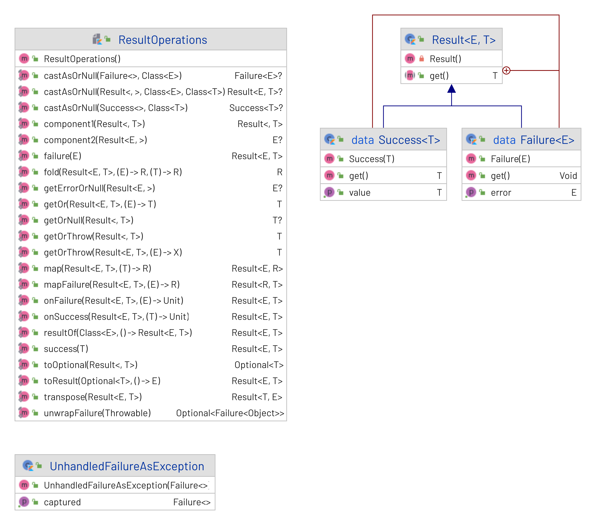

# `Result` Implementation for Kotlin 1.5


The `Result` class can be seen as specialized version of the `Either` monad. This monad by conventions allows the caller of function to return either the actual result, or the error. By convention this monad is declared (in general) terms:

```kotlin
abstract class Either<out Left,out Right>
```

By conventions the left side (denoted by `Left`) indicates the error value, followed by the right side for the result. Only one value can be present. Hence the 'either' moniker.

## Design considerations of the Result library

This project is an experiment to implement a more fluent and natural implementation of the `Result` pattern by:

1. Introducing errors handling to a domain in an explicit and deliberate way.
2. Providing a rich `Result` type which can be returned by APIs and consumed by callers.
3. Providing a procedural (non Object Orientated) style of handling exceptions(and errors).
4. Provide a more rigorous handling of errors from a functional perspective.
5. At the same time not forcing developers which is more comfortable with the try-catch style of handling exceptions to adopt a new functional style.

## Why Not ...?

Both Java and Kotlin has some mechanisms which can be exploited to handle error conditions in an API serfuce. Lets explore some reasons of why neither of these standard library API  fails to deliver.

### Use `kotlin.Result`

### Java  World

#### Use Java's `Optional<T>`

Java's optional is not intended to handle errors, rather it used to handle `null` in very explicit manner. Specifically an optional only indicate that a value is present, or not.

#### Use of domain exceptions

## High Level Overview

The Result library implementation can summarized by the following UML diagrams:


---

At this point note that:

1. `ResultOperations` represent a common library of operations applicable to`Result` types. 
2. These operations exposes a high level API which enables the user to leverage both traditional _try-catch_ semantics as well as _higher functions_ via lambdas.
3. The `UnhandledFailureAsException` class along with the `tryUnwrappingFailure()` function is used to bridge between functional style of error handling, and the more traditional OO style of using a `try-catch` 
4. Notice also that `Success.get()` returns an actual success value, while `Failure.get()` actually does not return anything. *In fact* –  the latter throws an exception if called.
5. The `Result<E,T>` class hierarchy is sealed. This means that at compile- and runtime there can only be, either an `Success<T>`, or `Failure<E>` instance for given `Result` instance.

## Library Use Case Patterns

A major objective of this library is to make domain errors front and center when implementing an API. This allows the caller/client on an API to know up front what can be go wrong with a call during normal operation,  and act accordingly.

For the reminder for this section is will be discussed in the context of a fictional digital wallet, called Acme Digital Wallet. The wallet is accessible via standard rest API as defined by an Open API spec.

### Improved API Design

### Pure Functional Error Handling

### Traditional Object Orientated Error Handling

### Hybrid Approach of Error handling
