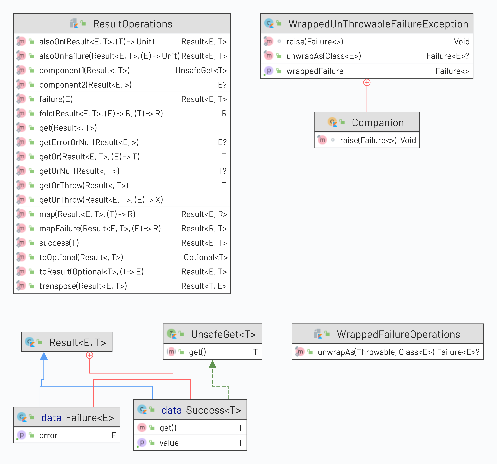

# `Result` Implementation for Kotlin 1.5

The `Result` class can be seen as specialized version of the `Either` monad. This monad by conventions allows the caller of function to return either the actual result, or the error. By convention this monad is declared (in general) terms:

```kotlin
abstract class Either<out L,out R> {
    // members elided
}
```

By conventions the left side (denoted by `L`) indicates the error value, followed by the right(`R`) side for the result. Only one value can be present. Hence the 'either' moniker.

## Design purpose of this `Result` implementation

This project is an experiment to implement a more fluent and natural implementation of the `Result` by:

- Provide a more procedural (non Object Orientated) style of handling exceptions(and errors) in Kotlin.
- Provide a more rigorous handling of errors from a functional perspective.
- At the same time not forcing developers which is more comfortable with the try-catch style of handling exceptions to adopt a new functional style.

## Why not just the standard library `kotlin.Result<T>` implementation

## Result.kt Exploration

The basic class can be expressed via the following UML diagram:


---
